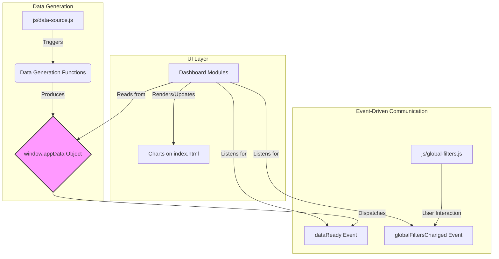
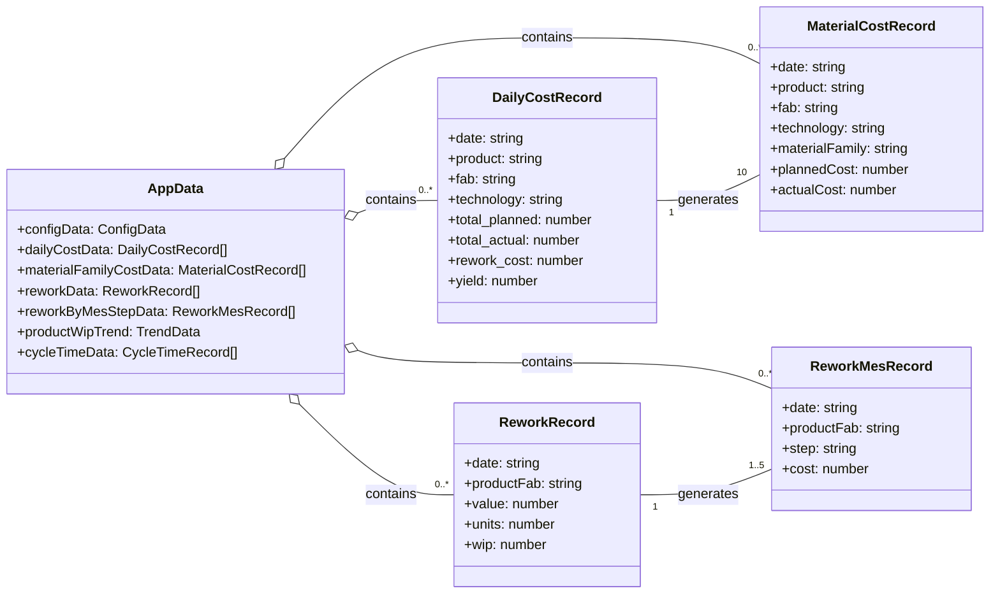
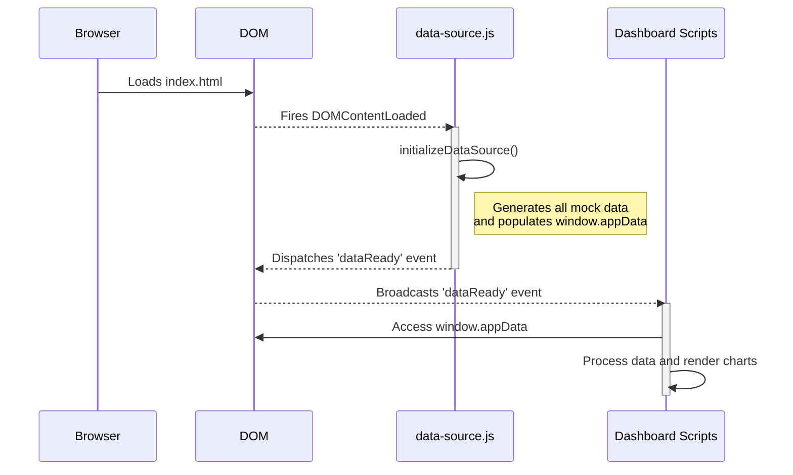
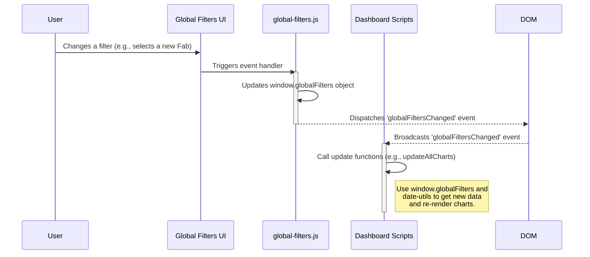

# Data Models & Flow

This document provides visual diagrams and detailed descriptions of the data flow, event sequence, and core data models within the application.

## High-Level Data Flow

## Core Data Object: `window.appData`

All data generated by `js/data-source.js` is stored in the global `window.appData` object. This object is the single source of truth for the entire application. The dashboard modules read from this object, filter it, and aggregate it to render their charts.

### Main Data Models

The following is a conceptual diagram of the key data models inside `window.appData` and their relationships.

### Model Descriptions

*   **`dailyCostData`**: This is the foundational dataset. It contains one record per product, per day. It tracks the overall planned vs. actual cost, yield, and rework costs. **This model is the primary source for most other data models.**
    *   *Example*: `{ date: "2023-10-26", product: "Product Alpha (Fab A)", total_planned: 41379, total_actual: 42810, ... }`

*   **`materialFamilyCostData`**: Generated directly from `dailyCostData`. For each daily cost record, it creates 10 records (one for each material family, like 'Substrates/Wafers' or 'Photomasks'). It breaks down the total product cost into material-specific planned and actual costs.
    *   *Example*: `{ date: "2023-10-26", product: "Product Alpha (Fab A)", materialFamily: "Substrates/Wafers", plannedCost: 5123, actualCost: 5432, ... }`

*   **`productWipTrend`**: An object formatted for a Chart.js time-series chart. It contains `labels` (dates) and `datasets`. Each dataset represents the Work-in-Progress (WIP) trend for a specific product over time.

*   **`reworkData`**: This array contains a record for each day a product experienced rework. It's calculated based on the WIP for that day.
    *   *Example*: `{ date: "2023-10-26", productFab: "Product Alpha (Fab A)", value: 5310, units: 106, wip: 480 }`

*   **`reworkByMesStepData`**: Generated from `reworkData`. Each rework event is broken down into several records, attributing the total rework cost to specific manufacturing (MES) steps.
    *   *Example*: `{ date: "2023-10-26", productFab: "Product Alpha (Fab A)", step: "Dielectric Etch (RIE/Plasma)", cost: 1593 }`

*   **`cycleTimeData`**: Contains records for simulated manufacturing lots, tracking the planned and actual time taken at each MES step. This is used for cycle time variance analysis.
    *   *Example*: `{ lotId: "lot-1", mesStep: "Wafer Cleaning", plannedTime: 120, actualTime: 125, variance: 5, ... }`

*   **`configData`**: An object containing configuration arrays used to populate the global filters, such as lists of all Fabs, Technologies, and Products.

## Application Startup Sequence

This diagram shows the sequence of events from the moment the page loads until the charts are rendered.

## Global Filter Update Flow

This diagram illustrates how the application responds when a user changes a global filter.

